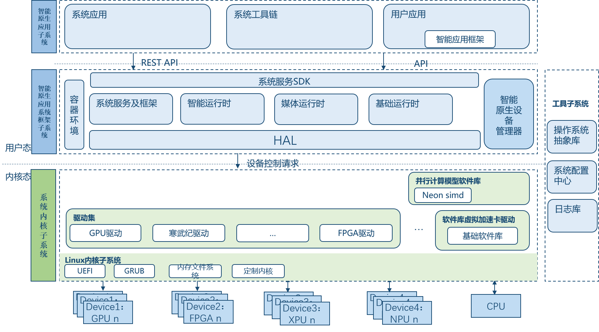

# INOS 简介

# 简介

智能原生操作系统（Intelligence Native Operating System，简称 INOS），以研究适配国产智能芯片为核心，改变传统以 CPU 为核心的操作系统底层架构，通过形成中央处理器和智能处理器协同的系统内核技术机制，提升面向智能原生操作系统的应用和生态能力，以避免未来的底层系统软件领域再被国外厂商垄断。

## 产品亮点

- **算力多样化**：支持主流的 CPU+xPU 异构算力
- **计算智能化**：内置轻量级 AI 框架，支持边/端智能计算
- **定制模块化**：支持根据不同领域场景需求，实现定制内核和领域应用
- **并行计算模型**：构建并行计算模型，实现 CPU+xPU 协同加速

# 架构

INOS 的核心模块主要分为 4 部分：

- **内核子系统**：以 Linux 内核子系统为基础，通过完善基础硬件资源库和驱动集合以适配各类 AI 芯片、CPU、FPGA 等硬件资源；通过虚拟加速卡和并行计算模型实现异构资源协同加速；
- **框架子系统**：通过 HAL 层屏蔽底层硬件差异，其它还包含系统服务及框架、基础运行时、媒体运行时、智能运行时、容器环境、设备管理器等；
- **应用子系统**：主要包括系统应用和工具链，此外提供智能应用框架供开发者快速开发第三方应用；
- **工具子系统**：主要包括操作系统抽象库、系统配置中心和日志库。

# 示例

以下为 YOLO v3 模型在寒武纪 270 板卡上基于 INOS v0.2.0 版本的测试结果：

| PETS2006 数据集        | pedestrians 数据集            |
| ---------------------- | ----------------------------- |
|  |  |
